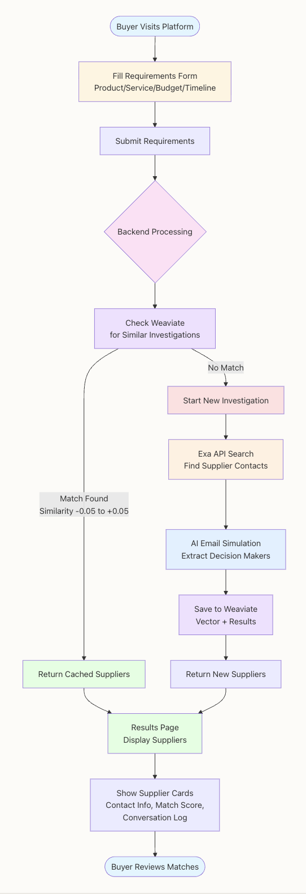

# Munich AI Hackathon - {Tech: Europe}

## Tacto Track: Supplier Sourcing Automation

Automates supplier sourcing end-to-end with the goal of accelerating the process from weeks to days: capture buyer requirements, find matching suppliers, enrich contacts, streamline the tedious back‑and‑forth outreach to identify the right decision‑maker, and present results.

## Description

This project provides an end-to-end workflow for automated supplier scouting:

- Capture buyer requirements via frontend
- Check for similar investigations in Weaviate to reuse results
- If needed, start a new EXA Websets research
- Automate outreach - mail conversations - until the right decision‑maker is identified and capture their work email
- Persist results in Weaviate and return them to the frontend

**Flowchart:**



**Goals:** faster matching, structured top results, and reduced manual research/outreach.

## Getting Started

**Technology partners used:**
- lovable
- openai 
- weaviate 

### Dependencies

- OS: macOS 14+/15, Windows 10+, or a recent Linux distro
- Node.js ≥ 18 and npm
- Python ≥ 3.11
- Weaviate Cloud instance with API key
- OpenAI API key (`OPENAI_API_KEY`)
- EXA API key (`EXA_API_KEY`)
- Backend environment variables (e.g., in `backend/.env`):
  - `WEAVIATE_URL`
  - `WEAVIATE_API_KEY`
  - `EXA_API_KEY`
  - `OPENAI_API_KEY`

Python dependencies (see `backend/requirements.txt`): FastAPI, Uvicorn, Pydantic, python-dotenv

### Installing

1. Clone the repository.
2. Backend setup:
   ```bash
   cd backend
   python3 -m venv .venv
   source .venv/bin/activate  # Windows: .venv\\Scripts\\activate
   pip install -r requirements.txt
   # Create .env with WEAVIATE_URL, WEAVIATE_API_KEY, EXA_API_KEY, OPENAI_API_KEY
   ```
3. Frontend setup (project root):
   ```bash
   npm install
   ```

### Executing program

- Start backend (default: port 8000):
  ```bash
  uvicorn backend.main:app --reload --host 0.0.0.0 --port 8000
  ```

- Start frontend (Vite dev server on port 8080):
  ```bash
  npm run dev
  ```

- Open the app at `http://localhost:8080`.

Key API endpoints (backend):

- POST `/api/v1/requirements` – submit buyer requirements, returns supplier results (cached if similar)
- GET `/api/v1/investigations/{investigation_id}/status` – check status and progress
- GET `/health` – health check

## Authors

- Muslim
- Leandro 
- David
- Moritz
